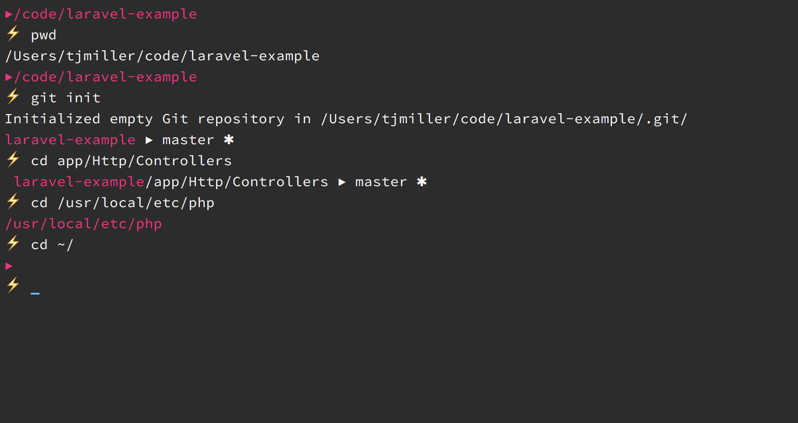

# sixlive zsh theme

This theme has a unique directory listing. When inside a Git project, the directory display is scoped to the current repository root.

## Preview



## Installation

1. Ensure your `ZSH_CUSTOM` variable is set in your `.zshrc` file (`ZSH_CUSTOM=$HOME/.oh-my-zsh-custom`)
2. In your `ZSH_CUSTOM` add the `sixlive.zsh-theme` to `themes/`
3. Activate the theme `ZSH_THEME="sixlive"` in your `.zshrc` file

Custom theme directory example after install:

```
/Users/tjmiller/.oh-my-zsh-custom/
└── themes
    └── sixlive.zsh-theme
```

## Colors

I've included my iTerm colors scheme.

1. Launch iTerm 2
2. Type CMD+i (⌘+i)
3. Navigate to Colors tab
4. Click on Load Presets
5. Click on Import
6. Select the `sixlive.itermcolors` file
7. Click on Load Presets and choose the color scheme

## Font

I'm using [Source Code Pro](https://github.com/powerline/fonts/tree/master/SourceCodePro) w/ powerline support.

## Contributing

Please see [CONTRIBUTING](CONTRIBUTING.md) for details.

## Security

If you discover any security related issues, please email oss@tjmiller.co instead of using the issue tracker.

## License

The MIT License (MIT). Please see [License File](LICENSE) for more information.
